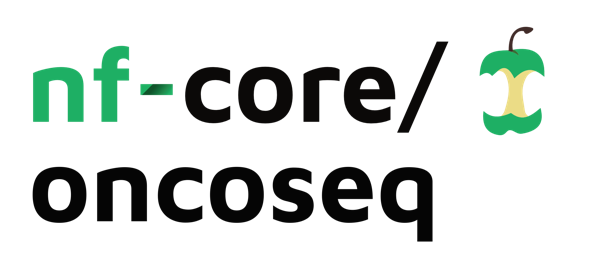

<h1>
  <picture>
    <source media="(prefers-color-scheme: dark)" srcset="docs/images/nf-core-oncoseq_logo_dark.png">
    
  </picture>
</h1>

[](https://github.com/nf-core/oncoseq/actions/workflows/ci.yml)
[](https://github.com/nf-core/oncoseq/actions/workflows/linting.yml)[](https://nf-co.re/oncoseq/results)[](https://doi.org/10.5281/zenodo.XXXXXXX)
[](https://www.nf-test.com)

[](https://www.nextflow.io/)
[](https://docs.conda.io/en/latest/)
[](https://www.docker.com/)
[](https://sylabs.io/docs/)
[](https://cloud.seqera.io/launch?pipeline=https://github.com/nf-core/oncoseq)

[](https://nfcore.slack.com/channels/oncoseq)[](https://twitter.com/nf_core)[](https://mstdn.science/@nf_core)[](https://www.youtube.com/c/nf-core)

## Introduction

**nf-core/oncoseq** is a bioinformatics pipeline that calls variants of interests for Oncology research from raw data to vcf files and digestible reports.

<!-- TODO nf-core:
   Complete this sentence with a 2-3 sentence summary of what types of data the pipeline ingests, a brief overview of the
   major pipeline sections and the types of output it produces. You're giving an overview to someone new
   to nf-core here, in 15-20 seconds. For an example, see https://github.com/nf-core/rnaseq/blob/master/README.md#introduction
-->

<!-- TODO nf-core: Include a figure that guides the user through the major workflow steps. Many nf-core
     workflows use the "tube map" design for that. See https://nf-co.re/docs/contributing/design_guidelines#examples for examples.   -->
<!-- TODO nf-core: Fill in short bullet-pointed list of the default steps in the pipeline -->
1. Basecalling with [Dorado](https://github.com/nanoporetech/dorado), it's possible to skip this step by supplying fastq files and using `--skip_basecalling`
2. Reads QC with [Seqkit](https://bioinf.shenwei.me/seqkit/)

### Adaptive mode:

3. Alignment with [minimap2](https://lh3.github.io/minimap2/minimap2.html) and alignment QC with [Cramino](https://github.com/wdecoster/cramino)
4. Sorting and indexing with [samtools](https://www.htslib.org/)
5. Separating the bam file between the background (off-panel) and region of interest (panel, including padding) with [samtools](https://www.htslib.org/)
6. Coverage calculation for ROIs in Panel with [mosdepth](https://github.com/brentp/mosdepth) and background coverage calculation with [Cramino](https://github.com/wdecoster/cramino)
7. Visualisation with [R](https://www.r-project.org/)

#### Variant Calling
8. SNP calling with [ClairS-TO](https://github.com/HKU-BAL/ClairS-TO) and annotation with [SnpEff](https://pcingola.github.io/SnpEff/)
9. Phasing of SNP variants and aligned BAM with [WhatsHap](https://whatshap.readthedocs.io/en/latest/index.html)
10. SV calling with [Sniffles2](https://github.com/fritzsedlazeck/Sniffles)
11. CNV calling with [QDNAseq](https://www.bioconductor.org/packages/release/bioc/html/QDNAseq.html)

### WGS mode:

3. Alignment with [minimap2](https://lh3.github.io/minimap2/minimap2.html) and alignment QC with [Cramino](https://github.com/wdecoster/cramino)
4. Sorting and indexing with [samtools](https://www.htslib.org/)

#### Variant Calling
5. SNP calling with [ClairS-TO](https://github.com/HKU-BAL/ClairS-TO) and annotation with [SnpEff](https://pcingola.github.io/SnpEff/)
6. Phasing of SNP variants and aligned BAM with [WhatsHap](https://whatshap.readthedocs.io/en/latest/index.html)
7. SV calling with [Sniffles2](https://github.com/fritzsedlazeck/Sniffles)
8. CNV calling with [QDNAseq](https://www.bioconductor.org/packages/release/bioc/html/QDNAseq.html)

### cf-DNA mode (In Development):

3. *TO COME* : Filter reads longer than 700 bp (if not a retinoblastoma) with [chopper](https://github.com/wdecoster/chopper)
3. Alignment of filtered reads with [minimap2](https://lh3.github.io/minimap2/minimap2.html) and alignment QC with [Cramino](https://github.com/wdecoster/cramino)
4. Sorting and indexing with [samtools](https://www.htslib.org/)

#### Variant Calling
5. CNV calling with [QDNAseq](https://www.bioconductor.org/packages/release/bioc/html/QDNAseq.html)
6. *TO COME* : Preparation of bins with [hmmcopy_utils](https://github.com/shahcompbio/hmmcopy_utils)
7. *TO COME* : CNV calling with [IchorCNA](https://github.com/broadinstitute/ichorCNA)

## Usage

> [!NOTE]
> If you are new to Nextflow and nf-core, please refer to [this page](https://nf-co.re/docs/usage/installation) on how to set-up Nextflow. Make sure to [test your setup](https://nf-co.re/docs/usage/introduction#how-to-run-a-pipeline) with `-profile test` before running the workflow on actual data.

<!-- TODO nf-core: Describe the minimum required steps to execute the pipeline, e.g. how to prepare samplesheets.
     Explain what rows and columns represent. For instance (please edit as appropriate): -->

First, prepare a samplesheet with your input data that looks as follows:

`samplesheet.csv`:

```csv
sample,input,ref,ref_path
sample1,/path/to/pod5,hg38,path/to/hg38.fa*
```

Each row represents the pod5 directory for one sample, and the reference to map it to.


Now, you can run the pipeline using:

<!-- TODO nf-core: update the following command to include all required parameters for a minimal example -->

```bash
nextflow run nf-core-oncoseq \
   -profile <docker/singularity/apptainer> \
   <--adaptive/wgs/cfdna>
   --input samplesheet.csv \
   --outdir <OUTDIR> \
   --clin_database /path/to/clindatabase
```

By default, the pipeline will run in adaptive mode, but the pipeline can also be run in WGS or cf-DNA mode using `--wgs` or `--cfdna` parameters respectively. Please see the pipeline output section to see which outputs are included with each mode. Please note that `--cfdna` mode is still in development.

The parameter `--clin_database` indicates the path to the ClinVar database that [SnpEff](https://pcingola.github.io/SnpEff/) will use to annotate the SNP vcf files. They can be downloaded here with https://ftp.ncbi.nlm.nih.gov/pub/clinvar/vcf_GRCh38/ for hg38 or with https://ftp.ncbi.nlm.nih.gov/pub/clinvar/vcf_GRCh37/ for hg19.

> [!WARNING]
> Please provide pipeline parameters via the CLI or Nextflow `-params-file` option. Custom config files including those provided by the `-c` Nextflow option can be used to provide any configuration _**except for parameters**_; see [docs](https://nf-co.re/docs/usage/getting_started/configuration#custom-configuration-files).

For more details and further functionality, please refer to the [usage documentation](https://nf-co.re/oncoseq/usage) and the [parameter documentation](https://nf-co.re/oncoseq/parameters).

## Pipeline output

To see the results of an example test run with a full size dataset refer to the [results](https://nf-co.re/oncoseq/results) tab on the nf-core website pipeline page.
For more details about the output files and reports, please refer to the
[output documentation](https://nf-co.re/oncoseq/output).

| File Path             | Description | Condition        |
| --------------------- | ----------- | ---------------- |
| reads/{sample}_passed.fq.gz | Merged raw reads that have passed filter of average QS >= `--minqs` | If --skip_basecalling is not used |
| reads/{sample}_failed.fq.gz | Merged raw reads that have failed filter of average QS >= `--minqs` | If --skip_basecalling is not used |
| alignments/{sample}.sorted.bam<br>alignments/{sample}.sorted.bam.bai | Aligned and sorted bam file mapped to reference along with it's index | Always |
| reports/seqkit/{sample}_pass.tsv<br>reports/{sample}_fail.tsv | Passed and failed fastq files stats | Always |
| reports/cramino/{sample}_cramino_stats.txt | Alignment summary stats | Always |
| reports/{sample}_coverage_mapq.pdf | Plot showing ROIs coverage | If `--adaptive` mode is used |
| variants/{sample}_snv_phased.vcf.gz<br>variants/{sample}_snv_clinvar_phased.vcf.gz<br>variants/{sample}_indel_phased.vcf.gz<br>variants/{sample}_indel_clinvar_phased.vcf.gz | VCF files of phased SNV and indels called by [ClairS-TO](https://github.com/HKU-BAL/ClairS-TO)  | If `--adaptive` or `--wgs` mode is used |
| variants/{sample}_sv.vcf.gz | VCF file of phased SV called by [Sniffles2](https://github.com/fritzsedlazeck/Sniffles) | If `--adaptive` or `--wgs` mode is used |
| variants/{sample}_cnv_calls.vcf.gz | VCF file of CNV called by [QDNAseq](https://www.bioconductor.org/packages/release/bioc/html/QDNAseq.html) | Always |
| phasing/{sample}_haplotagged.bam<br>phasing/{sample}_haplotagged.bam.bai | Aligned bam and index file including phasing HP tags added by [WhatsHap](https://whatshap.readthedocs.io/en/latest/index.html) | If `--adaptive` or `--wgs` mode is used |
| phasing/{sample}.haploblocks.gtf | Gtf files containing phase blocks | If `--adaptive` or `--wgs` mode is used |


## Credits

nf-core/oncoseq was originally written by CHUSJ-MPGI.

We thank the following people for their extensive assistance in the development of this pipeline:

<!-- TODO nf-core: If applicable, make list of people who have also contributed -->

## Contributions and Support

If you would like to contribute to this pipeline, please see the [contributing guidelines](.github/CONTRIBUTING.md).

For further information or help, don't hesitate to get in touch on the [Slack `#oncoseq` channel](https://nfcore.slack.com/channels/oncoseq) (you can join with [this invite](https://nf-co.re/join/slack)).

## Citations

<!-- TODO nf-core: Add citation for pipeline after first release. Uncomment lines below and update Zenodo doi and badge at the top of this file. -->
<!-- If you use nf-core/oncoseq for your analysis, please cite it using the following doi: [10.5281/zenodo.XXXXXX](https://doi.org/10.5281/zenodo.XXXXXX) -->

<!-- TODO nf-core: Add bibliography of tools and data used in your pipeline -->

An extensive list of references for the tools used by the pipeline can be found in the [`CITATIONS.md`](CITATIONS.md) file.

You can cite the `nf-core` publication as follows:

> **The nf-core framework for community-curated bioinformatics pipelines.**
>
> Philip Ewels, Alexander Peltzer, Sven Fillinger, Harshil Patel, Johannes Alneberg, Andreas Wilm, Maxime Ulysse Garcia, Paolo Di Tommaso & Sven Nahnsen.
>
> _Nat Biotechnol._ 2020 Feb 13. doi: [10.1038/s41587-020-0439-x](https://dx.doi.org/10.1038/s41587-020-0439-x).
