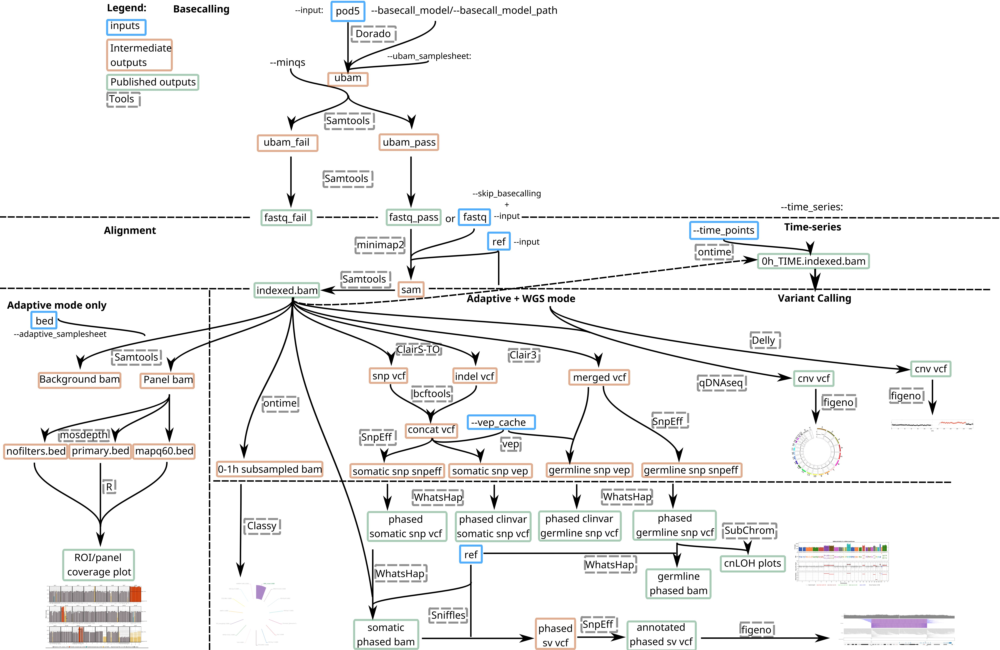
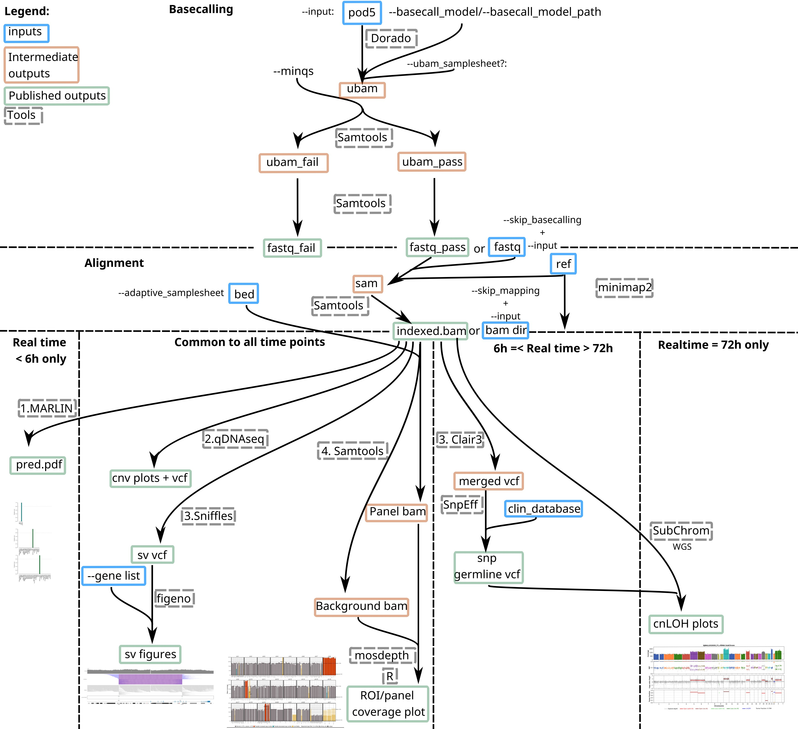

<h1>
  <picture>
    <source media="(prefers-color-scheme: dark)" srcset="docs/images/nf-core-oncoseq_logo_dark.png">
    
  </picture>
</h1>

[](https://nf-co.re/oncoseq/results)[](https://doi.org/10.5281/zenodo.XXXXXXX)
[](https://www.nf-test.com)

[](https://www.nextflow.io/)
[](https://docs.conda.io/en/latest/)
[](https://www.docker.com/)
[](https://sylabs.io/docs/)
[](https://cloud.seqera.io/launch?pipeline=https://github.com/nf-core/oncoseq)

[](https://nfcore.slack.com/channels/oncoseq)[](https://twitter.com/nf_core)[](https://mstdn.science/@nf_core)[](https://www.youtube.com/c/nf-core)

## Introduction

**nf-core/oncoseq** is a bioinformatics pipeline that calls variants of interests for Oncology research from raw data to vcf files and digestible reports.



---

## Pipeline Overview

The general steps are as followed:

1. **Basecalling** – [Dorado](https://github.com/nanoporetech/dorado)
   *(Optional: skip using `--skip_basecalling` if FASTQ input is provided)*
   *(Optional: Demultiplexing is done if kit is included in samplesheet and demux_samplesheet is provided)*
2. **Read QC** – [Seqkit](https://bioinf.shenwei.me/seqkit/)
3. **Alignment** – [minimap2](https://lh3.github.io/minimap2/minimap2.html)
   *(Optional: skip using `--skip_mapping` if bam input is provided)*
4. **Tumor Classification** – [Marlin](https://github.com/hovestadt/MARLIN), [Sturgeon](https://github.com/UMCUGenetics/sturgeon), [CrossNN](https://gitlab.com/euskirchen-lab/crossNN), [Tucan](https://github.com/UMCUGenetics/tucan)
5. **Alignment QC** – [Cramino](https://github.com/wdecoster/cramino)
6. **CNV/cnLOH calling** – [QDNAseq](https://www.bioconductor.org/packages/QDNAseq), [SubChrom](https://github.com/Shaohua-Lei/SubChrom), [Delly](https://github.com/dellytools/delly)
7. **Variant calling** – [ClairS-TO](https://github.com/HKU-BAL/ClairS-TO), [Clair3](https://github.com/HKU-BAL/Clair3)
8. **Structural variants** – [Sniffles2](https://github.com/fritzsedlazeck/Sniffles)
9. **VCF Annotation** – [SnpEff](https://pcingola.github.io/SnpEff/) and [Ensembl VEP](https://grch37.ensembl.org/info/docs/tools/vep/index.html)
10. **Phasing** – [WhatsHap](https://whatshap.readthedocs.io/) (`--adaptive` and `--wgs` only)
11. **Reporting** – [Quarto](https://quarto.org/) report summarizing coverage, variants, and methylation-based tumor classification

---

#### Adaptive specific

When `--adaptive` is used, additional steps are included for region-specific coverage:

1. **Coverage calculation** – [mosdepth](https://github.com/brentp/mosdepth)
2. **Visualization and reporting** – [R](https://www.r-project.org/)

---

#### Time Series Breakdown Analysis

For prospectively run workflows on different timepoints, [Ontime](https://github.com/mbhall88/ontime) is run after the **Alignment** step.

---

#### Tumor Classification

Runs on basecalled 5mC/5hmC reads if modified basecalling is used. Downsampling (`Ontime`) rules:

- `--adaptive` / `--wgs`: downsample to **1h**
- `--cfdna`: downsample to **8h** (if ≥10×)

| Classifier | Best for |
|---|---|
| *Marlin* | Leukemia |
| *Sturgeon*, *CrossNN Caper* | CNS tumors |
| *CrossNN Pancancer*, *Tucan* | Pan-cancer |

---

#### cf-DNA specific

- Filters reads **>700 bp** using *chopper* (if `filter = yes`)
- CNV/SV calling: *IchorCNA*, *QDNAseq*, *Delly*, *Sniffles2*
- SNP calling if ≥10×: *ClairS-TO*, *Clair3*
- SubChrom if ≥15×

To run IchorCNA as part of the cfDNA mode, include `-profile ichor_hg38` or `-profile ichor_hg19` depending on your reference genome.


---

## Usage

> [!NOTE]
> If you are new to Nextflow and nf-core, please refer to [this page](https://nf-co.re/docs/usage/installation) on how to set-up Nextflow. Make sure to [test your setup](https://nf-co.re/docs/usage/introduction#how-to-run-a-pipeline) with `-profile test` before running the workflow on actual data.

First, prepare a samplesheet with your input data that looks as follows:

`samplesheet.csv`:

| sample | project | input | genome | ref_path | kit | bed | padding | low_fidelity | purity | filter |
|--------|---------|-------|--------|----------|-----|-----|---------|--------------|--------|--------|
| sample1 | project1 | /path/to/pod5/ | hg38 | /path/to/ref/ | SQK-NBD114-24 | /path/to/bed.bed | 20000 | /path/to/low_fidelity.txt | 0.5 | yes |

**Samplesheet column descriptions:**

| Column | Required | Type | Description |
|--------|----------|------|-------------|
| `sample` | ✅ | `string` | Sample identifier |
| `project` | | `string` | Project ID for multiplexed samples |
| `input` | ✅ | `path` | Path to pod5, fastq, or bam files |
| `genome` | | `string` | Reference genome ID (`hg38`/`GRCh38`, `hg19`/`GRCh37`, `hs1`/`CHM13`). Takes priority over `--genome` if provided. Aliases are normalized to their canonical form. |
| `ref_path` | | `path` | Path to a reference FASTA file (`.fa`, `.fasta`, `.fa.gz`, `.fasta.gz`) or a directory containing one. Takes priority over `--ref_source`. If no `.fai` index is found, it will be generated automatically. If no FASTA is found for the resolved genome, it will be downloaded from UCSC FTP. |
| `kit` | | `string` | Barcoding kit for demultiplexing (e.g. `SQK-NBD114-24`) |
| `bed` | | `path` | BED file for adaptive sampling regions |
| `padding` | | `integer` | Padding around BED regions (bp) |
| `low_fidelity` | | `path` | Text file listing low-fidelity genes to exclude from coverage |
| `purity` | | `float` | Tumor purity estimate (0–1) for cf-DNA analysis |
| `filter` | | `string` | Filter reads by length for cf-DNA (`yes`/`no`) |

Now, you can run the pipeline using:

```bash
nextflow run nf-core/oncoseq \
   -profile narval \
   --input samplesheet.csv \
   --outdir results \
   --ref_source /path/to/reference/cache \
   --basecall_model 'sup' \
   --m_bases '5mCG_5hmCG' \
   [--adaptive | --wgs | --cfdna] \
   [--realtime INT] \
   [--skip_basecalling] \
   [--skip_mapping]
```

By default, the pipeline will run in adaptive mode starting from basecalling, but can also be run in WGS or cf-DNA mode using `--wgs` or `--cfdna` respectively. Please note that `--cfdna` mode is still in development.

If your input is already basecalled, use `--skip_basecalling` and provide the path to fastq files as input. If your input is already mapped with minimap2, use `--skip_mapping` and provide the path to bam files as input.

To run in real time while data is still sequencing, use `--realtime [INT]` where you must provide the sequencing time as an integer (hours). **This is only available for adaptive mode.**



| Process | 1h to 6h | 6h to 71h | 72h |
|-----------|----------|------|---------|
| CNV calling (Delly and QDNAseq) | ✅ | ✅ | ✅ |
| SV calling (Sniffles2) | ✅ | ✅ | ✅ |
| Tumor classification (Classy) | ✅ | | |
| SNP calling (Clair3) | | ✅ | ✅ |
| cnLOH calling (Subchrom) | | | ✅ |

> [!WARNING]
> Please provide pipeline parameters via the CLI or Nextflow `-params-file` option. Custom config files including those provided by the `-c` Nextflow option can be used to provide any configuration _**except for parameters**_; see [docs](https://nf-co.re/docs/usage/getting_started/configuration#custom-configuration-files).

For more details and further functionality, please refer to the [usage documentation](https://nf-co.re/oncoseq/usage) and the [parameter documentation](https://nf-co.re/oncoseq/parameters).

---

## Pipeline Parameters

### General Parameters

| Parameter | Required | Type | Default | Description |
|-----------|----------|------|---------|-------------|
| `--input` | ✅ | `path` | | Path to input samplesheet. |
| `--outdir` | ✅ | `path` | | Directory where outputs will be published. |
| `--genome` | | `string` | `hg38` | Reference genome ID (`hg38`/`GRCh38`, `hg19`/`GRCh37`, `hs1`/`CHM13`). Used when `genome` is not set in the samplesheet. |
| `--ref_source` | | `path` | | Path to a reference FASTA file or directory. Accepts `.fa`, `.fasta`, `.fa.gz`, `.fasta.gz`. If no `.fai` index is found, it will be generated automatically. If no FASTA is found for the resolved genome, it will be downloaded from UCSC FTP. If a `vep/` subdirectory is present, `--vep_cache` is not required. |
| `--basecall_model` | ✅ | `string` | | Dorado basecalling model (e.g. `sup`, `hac`, `fast`). Supports version pinning with `@v`. |
| `--m_bases` | ✅* | `string` | | Basecalling modification model (e.g. `5mCG_5hmCG`, `5mC`). **Required to enable tumor classification** |
| `--skip_basecalling` | | `boolean` | `false` | Skip basecalling; input is FASTQ files. |
| `--skip_mapping` | | `boolean` | `false` | Skip basecalling and mapping; input is BAM files. |
| `--demux` | | `boolean` | `false` | Enable demultiplexing (requires `kit` column in samplesheet). |

---

### Pipeline Modes

Choose exactly one mode:

| Parameter | Required | Type | Default | Description |
|-----------|----------|------|---------|-------------|
| `--adaptive` | | `boolean` | `false` | Adaptive sampling mode (requires `--bed` and `--padding`). |
| `--wgs` | | `boolean` | `false` | Whole Genome Sequencing mode. |
| `--cfdna` | | `boolean` | `false` | cf-DNA sequencing mode *(in development)*. |
| `--realtime` | | `integer` | | Real-time mode duration in hours. *Adaptive mode only*. |

---

### Adaptive Sampling Parameters

| Parameter | Required | Type | Default | Description |
|-----------|----------|------|---------|-------------|
| `--bed` | ✅* | `path` | v1.0.6-pre-merge-panel-20kb-pad.bed | BED file with target regions. *Required for `--adaptive`.* |
| `--padding` | ✅* | `integer` | `20000` | Padding (bp) around target regions. *Required for `--adaptive`.* |
| `--low_fidelity` | | `path` | default | Text file listing low-fidelity genes to exclude from coverage. |

---

### Basecalling and Mapping Options

| Parameter | Required | Type | Default | Description |
|-----------|----------|------|---------|-------------|
| `--minqs` | | `integer` | `10` | Minimum Phred quality score for read filtering. |
| `--device` | | `string` | | GPU device(s) for Dorado (e.g. `cuda:0,1`). Auto-detected if not specified. |
| `--batch` | | `integer` | | Batch size for basecalling. Auto-tuned if not specified. |
| `--mapping_small` | | `boolean` | `true` | Use reduced resources for mapping (recommended for adaptive/cfDNA). |

---

### Variant Calling Options

| Parameter | Required | Type | Default | Description |
|-----------|----------|------|---------|-------------|
| `--clairsto_model` | | `string` | `ont_r10_dorado_sup_5khz_ssrs` | ClairS-TO model for somatic SNV/indel calling. |
| `--qdnaseq_binsize` | | `integer` | `500` | Bin size (kb) for QDNAseq CNV calling. |
| `--subchrom_binsize` | | `integer` | `500` | Bin size (kb) for SubChrom CNV calling. |
| `--delly_bin_size` | | `integer` | `50000` | Bin size (bp) for Delly CNV calling. |
| `--sv_targets` | | `path` | `NOCSV` | CSV file for SV visualization: columns `GENE`, `pos` (Figeno output). |
| `--sv_exclude` | | `path` | default | Text file listing genes to exclude from SV analysis. |

---

### VEP Annotation Options

| Parameter | Required | Type | Default | Description |
|-----------|----------|------|---------|-------------|
| `--vep_cache` | ✅* | `path` | | Path to VEP cache directory. *Required for annotation unless a `vep/` subdirectory exists in `--ref_source`.* |
| `--vep_version` | | `integer` | `115` | Ensembl VEP version matching your cache. |
| `--filtervep_expression` | | `string` | IMPACT != LOW and IMPACT != MODIFIER and (gnomADe_AF <= 0.01 or not gnomADe_AF) and not CLIN_SIG matches benign and MANE | FilterVEP expression for SNV filtering (impacts, frequencies, etc.). |

---

### cf-DNA Mode Parameters

| Parameter | Required | Type | Default | Description |
|-----------|----------|------|---------|-------------|
| `--max_length` | | `integer` | `700` | Maximum read length (bp) for cf-DNA filtering (removes longer reads). |
| `--ichor_bin_size` | | `integer` | `500000` | Bin size (bp) for IchorCNA CNV calling. |
| `--min_mapq_ichor` | | `integer` | `20` | Minimum MAPQ threshold for IchorCNA. |
| `--rca` | | `boolean` | `false` | Enable rolling circle amplification mode (runs TideHunter). |

---

### Time Series Analysis Parameters

| Parameter | Required | Type | Default | Description |
|-----------|----------|------|---------|-------------|
| `--time_series` | | `boolean` | `false` | Enable time series analysis *only for adaptive mode* (downsamples via Ontime). |
| `--time_points` | | `string` | `1,3,6,12,18,24,48,60,72` | Comma-separated downsampling timepoints (hours). |
| `--include_full` | | `boolean` | `true` | Include full-depth analysis alongside downsampled timepoints. |

---

### Resource Parameters

| Parameter | Required | Type | Default | Description |
|-----------|----------|------|---------|-------------|
| `--ubam` | | `path` | `NOFILE` | Path to incomplete uBAM for basecalling resume. |
| `--max_memory` | | `string` | `16G` | Maximum memory any single process can consume. |
| `--max_cpus` | | `integer` | `4` | Maximum CPU cores any single process can use. |
| `--max_time` | | `string` | `4h` | Maximum execution time for any single process. |
| `--huge` | | `boolean` | `false` | Scale resource allocations for very large datasets. |

---

## Pipeline output

To see the results of an example test run with a full size dataset refer to the [results](https://nf-co.re/oncoseq/results) tab on the nf-core website pipeline page.
For more details about the output files and reports, please refer to the [output documentation](https://nf-co.re/oncoseq/output).

| File Path | Description | Condition |
|-----------|-------------|-----------|
| `reads/{sample}_passed.fq.gz` | Merged raw reads passing QS filter ≥ `--minqs` | `--skip_basecalling` not used |
| `reads/{sample}_failed.fq.gz` | Merged raw reads failing QS filter ≥ `--minqs` | `--skip_basecalling` not used |
| `alignments/{sample}.sorted.bam`<br>`alignments/{sample}.sorted.bam.bai` | Aligned and sorted BAM with index | Always |
| `variants/{sample}_snp_somatic_phased.vcf.gz`<br>`variants/{sample}_snp_somatic_vep.vcf.gz` | Phased somatic SNV/indels from [ClairS-TO](https://github.com/HKU-BAL/ClairS-TO) | `--adaptive` or `--wgs`, or `--cfdna` ≥10× |
| `variants/{sample}_snp_germline_phased.vcf.gz`<br>`variants/{sample}_snp_germline_vep.vcf.gz` | Phased germline SNV/indels from [Clair3](https://github.com/HKU-BAL/Clair3) | `--adaptive` or `--wgs`, or `--cfdna` ≥10× |
| `variants/{sample}_sv.vcf.gz` | Phased SVs from [Sniffles2](https://github.com/fritzsedlazeck/Sniffles) | Always |
| `variants/qdnaseq/{sample}_cnv_calls.vcf` | CNVs from [QDNAseq](https://www.bioconductor.org/packages/release/bioc/html/QDNAseq.html) | Always |
| `variants/delly/{sample}_cnv_calls.vcf` | CNVs from [Delly](https://github.com/dellytools/delly) | Always |
| `variants/subchrom/{sample}_cnv_calls.vcf` | CNVs from [SubChrom](https://github.com/Shaohua-Lei/SubChrom) | `--adaptive` or `--wgs` always; `--cfdna` ≥15× only |
| `phasing/{sample}_haplotagged.bam`<br>`phasing/{sample}_haplotagged.bam.bai` | Phased BAM with HP tags from [WhatsHap](https://whatshap.readthedocs.io/) | `--adaptive` or `--wgs` only |
| `phasing/{sample}.haploblocks.gtf` | Phase block GTF file | `--adaptive` or `--wgs` only |
| `reports/{sample}_report_output/` | Quarto report directory | Always |
| `reports/tumor_classifiers/` | Tumor classifier results | Always |
| `reports/seqkit/{sample}_pass.tsv`<br>`reports/{sample}_fail.tsv` | Read QC stats (passed/failed) | Always |
| `reports/cramino/{sample}_cramino_stats.txt` | Alignment summary stats | Always |
| `reports/{sample}_coverage_mapq.pdf` | ROI coverage plot | `--adaptive` only |

---

## Credits

nf-core/oncoseq was originally written by CHUSJ-MPGI.

We thank the following people for their extensive assistance in the development of this pipeline:

## Contributions and Support

If you would like to contribute to this pipeline, please see the [contributing guidelines](.github/CONTRIBUTING.md).

For further information or help, don't hesitate to get in touch on the [Slack `#oncoseq` channel](https://nfcore.slack.com/channels/oncoseq) (you can join with [this invite](https://nf-co.re/join/slack)).

## Citations

An extensive list of references for the tools used by the pipeline can be found in the [`CITATIONS.md`](CITATIONS.md) file.

You can cite the `nf-core` publication as follows:

> **The nf-core framework for community-curated bioinformatics pipelines.**
>
> Philip Ewels, Alexander Peltzer, Sven Fillinger, Harshil Patel, Johannes Alneberg, Andreas Wilm, Maxime Ulysse Garcia, Paolo Di Tommaso & Sven Nahnsen.
>
> _Nat Biotechnol._ 2020 Feb 13. doi: [10.1038/s41587-020-0439-x](https://dx.doi.org/10.1038/s41587-020-0439-x).
