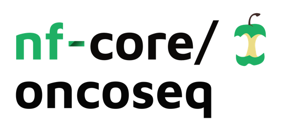
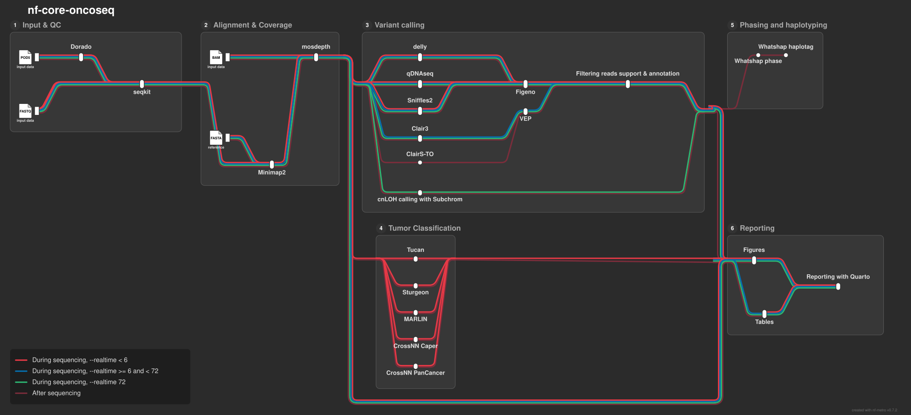

<h1>
  <picture>
    <source media="(prefers-color-scheme: dark)" srcset="docs/images/nf-core-oncoseq_logo_dark.png">
    
  </picture>
</h1>

[](https://nf-co.re/oncoseq/results)[](https://doi.org/10.5281/zenodo.XXXXXXX)
[](https://www.nf-test.com)

[](https://www.nextflow.io/)
[](https://www.docker.com/)
[](https://sylabs.io/docs/)
[](https://cloud.seqera.io/launch?pipeline=https://github.com/nf-core/oncoseq)

[](https://nfcore.slack.com/channels/oncoseq)[](https://twitter.com/nf_core)[](https://mstdn.science/@nf_core)[](https://www.youtube.com/c/nf-core)

**Please note that for now, the workflow is not compatible with Nextflow v26. Please use Nextflow v25 to run this workflow.**

## Quick Start

```bash
nextflow run nf-core/oncoseq \
   --input samplesheet.csv \
   --outdir results \
   --ref_cache /path/to/reference/cache \
   --basecall_model 'sup' \
   --m_bases '5mCG_5hmCG' \
   [--realtime INT] \
   [--skip_basecalling] \
   [--skip_mapping]
```

With `--input` samplesheet:

| sample | input |
|--------|---------|
| sample1 | /path/to/input/ |

## Introduction

**nf-core/oncoseq** is a bioinformatics pipeline that calls variants of interest for Oncology research, from raw sequencing data to VCF files and digestible reports.

> [!NOTE]
> This pipeline is currently designed for **human genomes only**, supporting the following reference assemblies:
> | Genome | Aliases |
> |--------|---------|
> | hg38 | GRCh38 |
> | hg19 | GRCh37 |
> | hs1  | CHM13  |



---

## Pipeline Overview

The general steps are as follows:

1. **Basecalling** – [Dorado](https://github.com/nanoporetech/dorado)
   *(Optional: skip using `--skip_basecalling` if FASTQ input is provided)*
   *(Optional: Demultiplexing is done if kit and barcode is included in samplesheet*
2. **Read QC** – [Seqkit](https://bioinf.shenwei.me/seqkit/)
3. **Alignment** – [minimap2](https://lh3.github.io/minimap2/minimap2.html)
   *(Optional: skip using `--skip_mapping` if BAM input is provided)*
4. **Tumor Classification** – [Marlin](https://github.com/hovestadt/MARLIN), [CrossNN](https://gitlab.com/euskirchen-lab/crossNN), [Tucan](https://github.com/UMCUGenetics/tucan), [Sturgeon](https://github.com/UMCUGenetics/sturgeon)
5. **Alignment QC** – [Cramino](https://github.com/wdecoster/cramino)
6. **CNV/cnLOH calling** – [QDNAseq](https://www.bioconductor.org/packages/QDNAseq), [SubChrom](https://github.com/Shaohua-Lei/SubChrom), [Delly](https://github.com/dellytools/delly), [IchorCNA](https://github.com/broadinstitute/ichorCNA)
7. **Variant calling** – [ClairS-TO](https://github.com/HKU-BAL/ClairS-TO), [Clair3](https://github.com/HKU-BAL/Clair3)
8. **Structural variants** – [Sniffles2](https://github.com/fritzsedlazeck/Sniffles), [Severus](https://github.com/KolmogorovLab/Severus) and [Stellerator](https://github.com/chusj-pigu/stellerator)
9. **VCF Annotation** – [SnpEff](https://pcingola.github.io/SnpEff/) and [Ensembl VEP](https://www.ensembl.org/info/docs/tools/vep/index.html)
10. **Phasing** – [WhatsHap](https://whatshap.readthedocs.io/) (excluded in `--cfdna` mode)
11. **Reporting** – [Quarto](https://quarto.org/) report summarizing coverage, variants, and methylation-based tumor classification

> [!WARNING]
> [QDNAseq](https://www.bioconductor.org/packages/QDNAseq), [SubChrom](https://github.com/Shaohua-Lei/SubChrom) and [IchorCNA](https://github.com/broadinstitute/ichorCNA) do not support the CHM13/hs1 reference genome and will be automatically skipped when `--genome hs1` is used.

---

#### Time Series Breakdown Analysis

For prospectively run workflows on different timepoints, [Ontime](https://github.com/mbhall88/ontime) is run after the **Alignment** step. To use, specify `--time_series` and `--time_points` (comma-separated list of hours) to downsample the reads to the specified timepoints. The default timepoints are `1,3,6,12,18,24,48,60,72` hours. The downsampled reads are then used for downstream analysis.

---

#### Tumor Classification

Runs on basecalled 5mC/5hmC reads if modified basecalling is used. Only reads generated in the first hour of sequencing are used, except for `--cfdna` mode, where tumor classification is run on the filtered reads (≤700 bp) if `filter = yes` in the samplesheet.

> [!WARNING]
> These classifiers are run within a Rust integration called classy, and use liftovers when `--genome` does not match the program probes. Results may differ from the original programs.

---

#### cf-DNA specific

- Filters reads **>700 bp** using *chopper* (if `filter = yes`)
- CNV/SV calling: *IchorCNA*, *QDNAseq*, *Delly*, *Sniffles2*
- SNP calling if ≥10×: *ClairS-TO*, *Clair3*
- SubChrom if ≥15×

To run IchorCNA as part of the cfDNA mode, include `-profile ichor_hg38` or `-profile ichor_hg19` depending on your reference genome.

---

## Usage

> [!NOTE]
> If you are new to Nextflow and nf-core, please refer to [this page](https://nf-co.re/docs/usage/installation) on how to set-up Nextflow. Make sure to [test your setup](https://nf-co.re/docs/usage/introduction#how-to-run-a-pipeline) with `-profile test` before running the workflow on actual data.

First, prepare a samplesheet with your input data that looks as follows:

`samplesheet.csv`:

| sample | input | purity | filter |
|--------|---------|---------|---------|
| sample1 | /path/to/input/ | *`--cfdna` only* | *`--cfdna` only* |

Most input can be provided as command line parameters if they are common, but they can also be provided in the samplesheet if they differ between samples:

**Samplesheet column descriptions:**

| Column | Required | Type | CLI parameter | Description |
|--------|----------|------|---------------|-------------|
| `sample` | ✅ | `string` | | Sample identifier |
| `project` | | `string` | | Project ID for multiplexed samples |
| `input` | ✅ | `path` | | Path to pod5, fastq, or bam files. If bam files are provided, it's assumed that they are sorted by genomic coordinate. |
| `genome` | | `string` | `--genome` | Reference genome ID (`hg38`/`GRCh38`, `hg19`/`GRCh37`, `hs1`/`CHM13`). Samplesheet takes priority over `--genome`. Aliases are normalized to their canonical form. |
| `ref_path` | | `path` | `--ref_cache` | Path to a reference FASTA file (`.fa`, `.fasta`, `.fa.gz`, `.fasta.gz`) or a directory containing one. Samplesheet takes priority over `--ref_cache`. If no `.fai` index is found, it will be generated automatically. If no FASTA is found for the resolved genome, it will be downloaded from UCSC FTP. |
| `kit` | | `string` | | Barcoding kit for demultiplexing (e.g. `SQK-NBD114-24`). Required alongside `project` and `barcode` when using `--demux`. |
| `bed` | | `path` | `--bed` | BED file for adaptive sampling regions. Samplesheet takes priority over `--bed`. |
| `padding` | | `integer` | `--padding` | Padding around BED regions (bp). Samplesheet takes priority over `--padding`. |
| `low_fidelity` | | `path` | `--low_fidelity` | Text file listing low-fidelity genes to exclude from coverage. Samplesheet takes priority over `--low_fidelity`. |
| `purity` | | `float` | | Tumor purity estimate (0–1) for cf-DNA analysis. Required when using `--cfdna`. |
| `filter` | | `string` | | Whether to filter reads longer than `--max_length` for cf-DNA (`yes`/`no`). |

If your input is already basecalled, use `--skip_basecalling` and provide the path to fastq files as input. If your input is already mapped with minimap2, use `--skip_mapping` and provide the path to bam files as input.

To run in real time while data is still sequencing, use `--realtime [INT]` where you must provide the sequencing time as an integer (hours).

| Process | 1h to 6h | 6h to 71h | 72h |
|-----------|----------|------|---------|
| CNV calling (Delly and QDNAseq) | ✅ | ✅ | ✅ |
| SV calling (Sniffles2, Severus, Stellerator) | ✅ | ✅ | ✅ |
| Tumor classification (Classy) | ✅ | | |
| SNP calling (Clair3) | | ✅ | ✅ |
| cnLOH calling (Subchrom) | | | ✅ |

> [!WARNING]
> Please provide pipeline parameters via the CLI or Nextflow `-params-file` option. Custom config files including those provided by the `-c` Nextflow option can be used to provide any configuration _**except for parameters**_; see [docs](https://nf-co.re/docs/usage/getting_started/configuration#custom-configuration-files).

For more details and further functionality, please refer to the [usage documentation](https://nf-co.re/oncoseq/usage) and the [parameter documentation](https://nf-co.re/oncoseq/parameters).

---

## Pipeline Parameters

### General Parameters

| Parameter | Required | Type | Default | Description |
|-----------|----------|------|---------|-------------|
| `--input` | ✅ | `path` | | Path to input samplesheet. |
| `--outdir` | ✅ | `path` | | Directory where outputs will be published. |
| `--genome` | | `string` | `hg38` | Reference genome ID (`hg38`/`GRCh38`, `hg19`/`GRCh37`, `hs1`/`CHM13`). Used when `genome` is not set in the samplesheet. |
| `--ref_cache` | | `path` | | Path to a reference FASTA file or directory. Accepts `.fa`, `.fasta`, `.fa.gz`, `.fasta.gz`. If no `.fai` index is found, it will be generated automatically. If no FASTA is found for the resolved genome, it will be downloaded from UCSC FTP. If a `vep/` subdirectory is present, `--vep_cache` is not required. |
| `--basecall_model` | ✅ | `string` | | Dorado basecalling model (e.g. `sup`, `hac`, `fast`). Supports version pinning with `@v`. |
| `--m_bases` | ✅* | `string` | | Basecalling modification model (e.g. `5mCG_5hmCG`, `5mC`). **Required to enable tumor classification** |
| `--skip_basecalling` | | `boolean` | `false` | Skip basecalling; input is FASTQ files. |
| `--skip_mapping` | | `boolean` | `false` | Skip basecalling and mapping; input is BAM files. |
| `--demux` | | `boolean` | `false` | Enable demultiplexing (requires `kit` column in samplesheet). |
| `--bed` | ✅* | `path` | v2.0.1-pre-merge-panel-20kb-pad.bed | BED file with 657 regions of interest, including regions for known germline and somatic variants in cancer.|

---

### Pipeline Modes

Choose exactly one mode:

| Parameter | Required | Type | Default | Description |
|-----------|----------|------|---------|-------------|
| `--cfdna` | | `boolean` | `false` | cf-DNA sequencing mode. |
| `--realtime` | | `integer` | | Real-time mode duration in hours. |

---

### Adaptive Sampling Parameters

| Parameter | Required | Type | Default | Description |
|-----------|----------|------|---------|-------------|
| `--padding` | ✅* | `integer` | `20000` | Padding (bp) around target regions. *Required for `--adaptive`.* |
| `--low_fidelity` | | `path` | default | Text file listing low-fidelity genes to exclude from coverage. |

---

### Basecalling and Mapping Options

| Parameter | Required | Type | Default | Description |
|-----------|----------|------|---------|-------------|
| `--minqs` | | `integer` | `10` | Minimum Phred quality score for read filtering. |
| `--device` | | `string` | | GPU device(s) for Dorado (e.g. `cuda:0,1`). Auto-detected if not specified. |
| `--batch` | | `integer` | | Batch size for basecalling. Auto-tuned if not specified. |
| `--mapping_small` | | `boolean` | `true` | Use reduced resources for mapping (recommended for adaptive/cfDNA). |

---

### Variant Calling Options

| Parameter | Required | Type | Default | Description |
|-----------|----------|------|---------|-------------|
| `--clairsto_model` | | `string` | `ont_r10_dorado_sup_5khz_ssrs` | ClairS-TO model for somatic SNV/indel calling. |
| `--qdnaseq_binsize` | | `integer` | `500` | Bin size (kb) for QDNAseq CNV calling. |
| `--subchrom_binsize` | | `integer` | `500` | Bin size (kb) for SubChrom CNV calling. |
| `--delly_bin_size` | | `integer` | `50000` | Bin size (bp) for Delly CNV calling. |
| `--sv_targets` | | `path` | assets/sv-list.csv | CSV file for additional SV visualization of regions often involved in intragenic deletions: columns `GENE`, `pos` (Figeno output). |
| `--fusion_targets` | | `path` | assets/fusion-list.csv | CSV file containing fusions partners to call with stellerator: First column is the first partner, second column is the second partner. Default is a list of known fusions involved in solid and hematological tumors. |
| `--sv_exclude` | | `path` | assets/sv_exclude.txt" | Text file listing genes to exclude from SV analysis. The default includes structural variants that come up for the majority of samples and are not clinically known to be relevant. |
| `--snp_exclude` | | `path` | assets/snp_exclude.txt" | Text file listing genes to exclude from SNP analysis. The default includes variants that are not clinically relevant. |

---

### VEP Annotation Options

| Parameter | Required | Type | Default | Description |
|-----------|----------|------|---------|-------------|
| `--vep_cache` | ✅* | `path` | | Path to VEP cache directory. *Required for annotation unless a `vep/` subdirectory exists in `--ref_cache`.* |
| `--vep_version` | | `integer` | `115` | Ensembl VEP version matching your cache. |
| `--filtervep_expression` | | `string` | IMPACT != LOW and IMPACT != MODIFIER and (gnomADe_AF <= 0.01 or not gnomADe_AF) and not CLIN_SIG matches benign and MANE | FilterVEP expression for SNV filtering (impacts, frequencies, etc.). |

---

### cf-DNA Mode Parameters

| Parameter | Required | Type | Default | Description |
|-----------|----------|------|---------|-------------|
| `--max_length` | | `integer` | `700` | Maximum read length (bp) for cf-DNA filtering (removes longer reads). |
| `--ichor_bin_size` | | `integer` | `500000` | Bin size (bp) for IchorCNA CNV calling. |
| `--min_mapq_ichor` | | `integer` | `20` | Minimum MAPQ threshold for IchorCNA. |

---

### Time Series Analysis Parameters

| Parameter | Required | Type | Default | Description |
|-----------|----------|------|---------|-------------|
| `--time_series` | | `boolean` | `false` | Enable time series analysis *only for adaptive mode* (downsamples via Ontime). |
| `--time_points` | | `string` | `1,3,6,12,18,24,48,60,72` | Comma-separated downsampling timepoints (hours). |
| `--include_full` | | `boolean` | `true` | Include full-depth analysis alongside downsampled timepoints. |

---

### Resource Parameters

| Parameter | Required | Type | Default | Description |
|-----------|----------|------|---------|-------------|
| `--ubam` | | `path` | `NOFILE` | Path to incomplete uBAM for basecalling resume. |
| `--max_memory` | | `string` | `16G` | Maximum memory any single process can consume. |
| `--max_cpus` | | `integer` | `4` | Maximum CPU cores any single process can use. |
| `--max_time` | | `string` | `4h` | Maximum execution time for any single process. |
| `--huge` | | `boolean` | `false` | Scale resource allocations for very large datasets. |

---

## Pipeline output

<table>
  <thead>
    <tr>
      <th>Type</th>
      <th>File Path</th>
      <th>Description</th>
      <th>Condition</th>
    </tr>
  </thead>
  <tbody>
    <tr>
      <td rowspan="2">Reads</td>
      <td><code>reads/{sample}_passed.fq.gz</code></td>
      <td>Merged raw reads passing QS filter ≥ <code>--minqs</code></td>
      <td><code>--skip_basecalling</code> not used</td>
    </tr>
    <tr>
      <td><code>reads/{sample}_failed.fq.gz</code></td>
      <td>Merged raw reads failing QS filter ≥ <code>--minqs</code></td>
      <td><code>--skip_basecalling</code> not used</td>
    </tr>
    <tr>
      <td rowspan="2">Alignments</td>
      <td>
        <code>alignments/{sample}.indexed.bam</code><br>
        <code>alignments/{sample}.indexed.bam.bai</code>
      </td>
      <td>Aligned and sorted BAM with index</td>
      <td>Always</td>
    </tr>
    <tr>
      <td>
        <code>phasing/{sample}_haplotagged.bam</code><br>
        <code>phasing/{sample}_haplotagged.bam.bai</code>
      </td>
      <td>Phased BAM with HP tags from <a href="https://whatshap.readthedocs.io/">WhatsHap</a></td>
      <td>Excluded from<code>--cfdna</code></td>
    </tr>
    <tr>
      <td rowspan="8">Variants</td>
      <td>
        <code>variants/{sample}_snp_somatic_phased.vcf.gz</code><br>
        <code>variants/{sample}_snp_somatic_vep.vcf.gz</code>
      </td>
      <td>Phased somatic SNV/indels from <a href="https://github.com/HKU-BAL/ClairS-TO">ClairS-TO</a></td>
      <td>For <code>--cfdna</code>, only if coverage ≥10×</td>
    </tr>
    <tr>
      <td>
        <code>variants/{sample}_snp_germline_phased.vcf.gz</code><br>
        <code>variants/{sample}_snp_germline_vep.vcf.gz</code>
      </td>
      <td>Phased germline SNV/indels from <a href="https://github.com/HKU-BAL/Clair3">Clair3</a></td>
      <td>For <code>--cfdna</code>, only if coverage ≥10×</td>
    </tr>
    <tr>
      <td><code>variants/{sample}_sv.vcf.gz</code></td>
      <td>Phased SVs from <a href="https://github.com/fritzsedlazeck/Sniffles">Sniffles2</a></td>
      <td>Always</td>
    </tr>
    <tr>
      <td><code>variants/{sample}_sv_severus.vcf.gz</code></td>
      <td>Phased structural variants found by <a href="https://github.com/KolmogorovLab/Severus">Severus</a> and annotated by EnsemblVep</td>
      <td>Always</td>
    </tr>
    <tr>
      <td><code>variants/qdnaseq/{sample}_cnv_calls.vcf</code></td>
      <td>CNVs from <a href="https://www.bioconductor.org/packages/release/bioc/html/QDNAseq.html">QDNAseq</a></td>
      <td>Always</td>
    </tr>
    <tr>
      <td><code>variants/delly/{sample}_cnv_calls.vcf</code></td>
      <td>CNVs from <a href="https://github.com/dellytools/delly">Delly</a></td>
      <td>Always</td>
    </tr>
    <tr>
      <td><code>variants/subchrom/{sample}_cnv_calls.vcf</code></td>
      <td>CNVs from <a href="https://github.com/Shaohua-Lei/SubChrom">SubChrom</a></td>
      <td>For <code>--cfdna</code>, only if coverage ≥10×</td>
    </tr>
    <tr>
      <td><code>phasing/{sample}.haploblocks.gtf</code></td>
      <td>Phase block GTF file</td>
      <td>For <code>--cfdna</code>, only if coverage ≥10×</td>
    </tr>
    <tr>
      <td rowspan="5">Report</td>
      <td><code>reports/{sample}_report_output/{sample}.html</code></td>
      <td>Quarto report directory</td>
      <td>Always</td>
    </tr>
    <tr>
      <td><code>reports/tumor_classifiers/</code></td>
      <td>Tumor classifier results</td>
      <td>Always</td>
    </tr>
    <tr>
      <td>
        <code>reports/seqkit/{sample}_pass.tsv</code><br>
        <code>reports/{sample}_fail.tsv</code>
      </td>
      <td>Read QC stats (passed/failed)</td>
      <td>Always</td>
    </tr>
    <tr>
      <td><code>reports/cramino/{sample}_cramino_stats.txt</code></td>
      <td>Alignment summary stats</td>
      <td>Always</td>
    </tr>
  </tbody>
</table>

---

## Credits

nf-core/oncoseq was originally written by CHUSJ-MPGI.

<!-- We thank the following people for their extensive assistance in the development of this pipeline: -->

## Contributions and Support

If you would like to contribute to this pipeline, please see the [contributing guidelines](.github/CONTRIBUTING.md).

For further information or help, don't hesitate to get in touch on the [Slack `#oncoseq` channel](https://nfcore.slack.com/channels/oncoseq) (you can join with [this invite](https://nf-co.re/join/slack)).

## Citations

An extensive list of references for the tools used by the pipeline can be found in the [`CITATIONS.md`](CITATIONS.md) file.

You can cite the `nf-core` publication as follows:

> **The nf-core framework for community-curated bioinformatics pipelines.**
>
> Philip Ewels, Alexander Peltzer, Sven Fillinger, Harshil Patel, Johannes Alneberg, Andreas Wilm, Maxime Ulysse Garcia, Paolo Di Tommaso & Sven Nahnsen.
>
> _Nat Biotechnol._ 2020 Feb 13. doi: [10.1038/s41587-020-0439-x](https://dx.doi.org/10.1038/s41587-020-0439-x).
